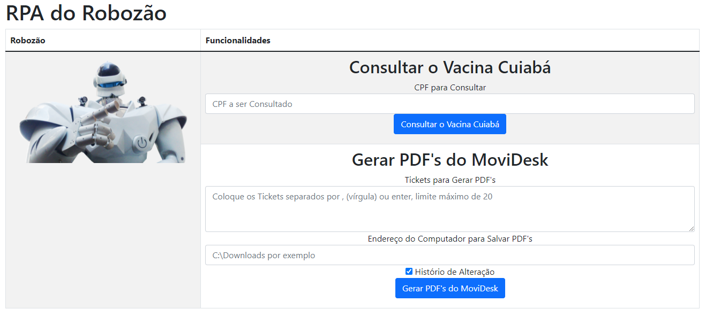

# Criando um Bot com PYAUTOGUI e utilizando o Flask para Interface para Usuário
O pyautogui foi escolhido pela possibilidade de fazer a identificação dos locais onde o bot irá dar os clicks através das imagens (pasta `static/img_movidesk` ou `static/img_vacina`)

 * [Objetivo](#Objetivo)
 * [Consultar Vacina Cuiabá](#consultar-vacina-cuiab%C3%A1)
 * [Gerar PDF's do MoviDesk](#gerar-pdfs-do-movidesk)
 * [Tecnologias](#tecnologias)
   
<h1 align="center">
  
</h1>

## Objetivo
O objetivo do projeto foi testar a tecnologia do pyautogui e o Flask, e para ter uma utilidade foi feito através da Vacina Cuiabá, onde é um site aberto ao público e todos podem entender como funciona. 
Também foi implementado uma funcionalidade mais útil e complicada, que é a Geração de PDF's de chamados (Tickets) do Sistema <a href="https://www.movidesk.com/">Movidesk</a>.

## Consultar Vacina Cuiabá
Este bot vai até a parte de consulta o CPF do Vacina Cuiabá, preenchendo o CPF Informado. 

## Gerar PDF's do MoviDesk
Esta bot utiliza uma lista de até 20 tickets já cadastrado no sistema Movidesk e informado na tela, separados através de "," (vírgula) ou enter, é necessário também o local indicado pelo usuário na sua máquina para salvar os PDF's e também se deseja que a opção do histórico de alteração esteja marcada. Com isso ele gera os PDF's na pasta selecionada, caso todos os requisitos sejam cumpridos.

### Vídeo da Utilização no Youtube

### Requisitos
Para o sistema funcionar, é necessário que:
* O usuário esteja logado no Movidesk
* Os Tickets existam
* A impressora no browser esteja configurada para Gerar PDF (Botão será Salvar na impressão)

## Tecnologias
As tecnologias utilizadas foram o pyautogui e o Flask, sendo que para o pyautogui realizar o reconhecimento das imagens foi necessário instalar o Pillow e o opencv-python. 

## Instalação
Para realizar a instalação é necessário instalar todas as dependências do projeto, pode utilizar o arquivo `requirements.txt` com o comando `pip install -r requirements.txt`
